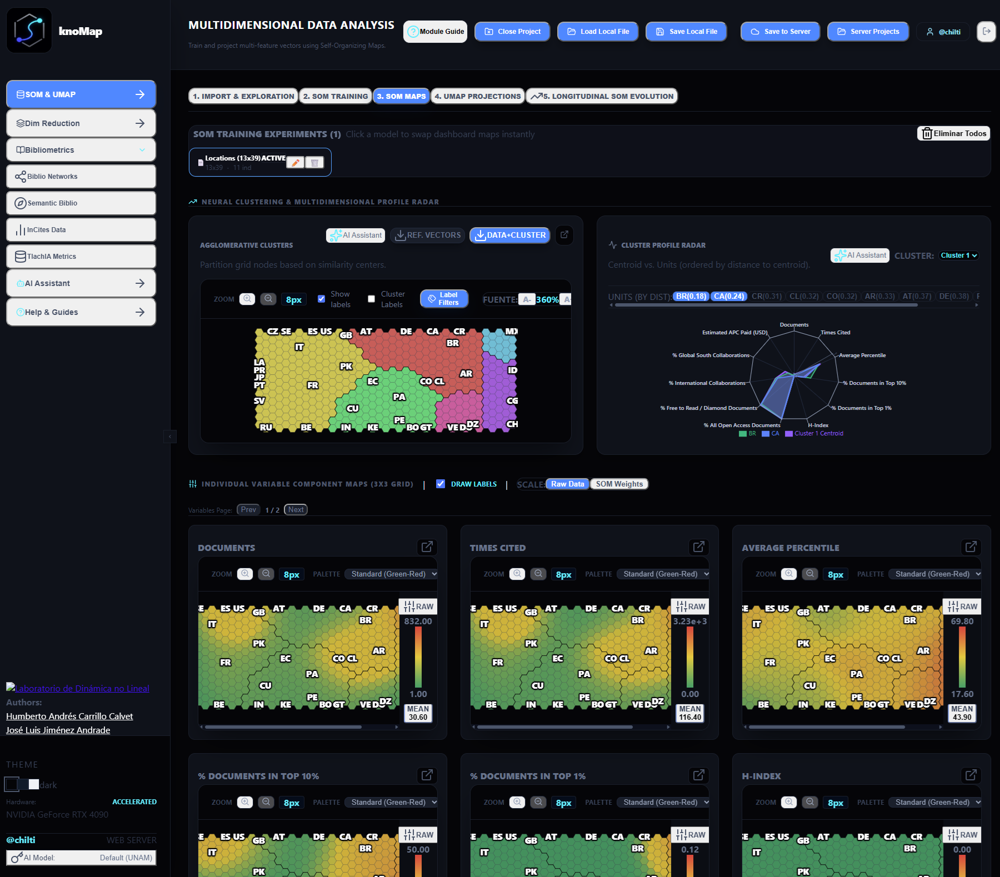
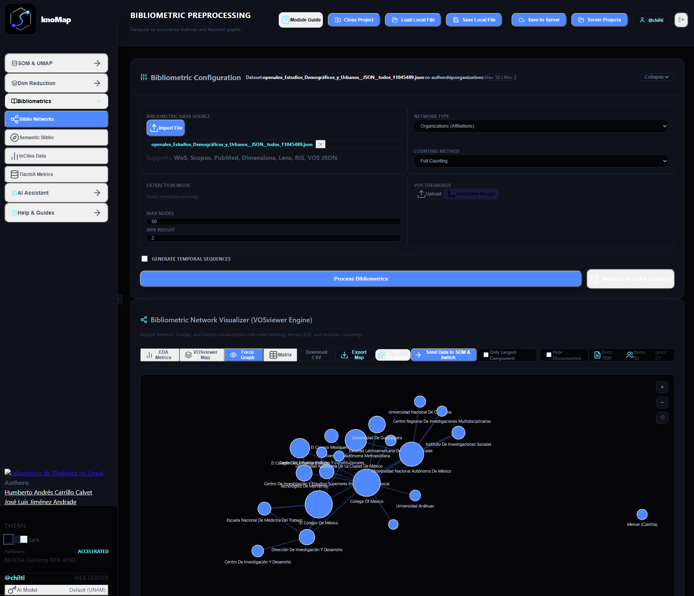
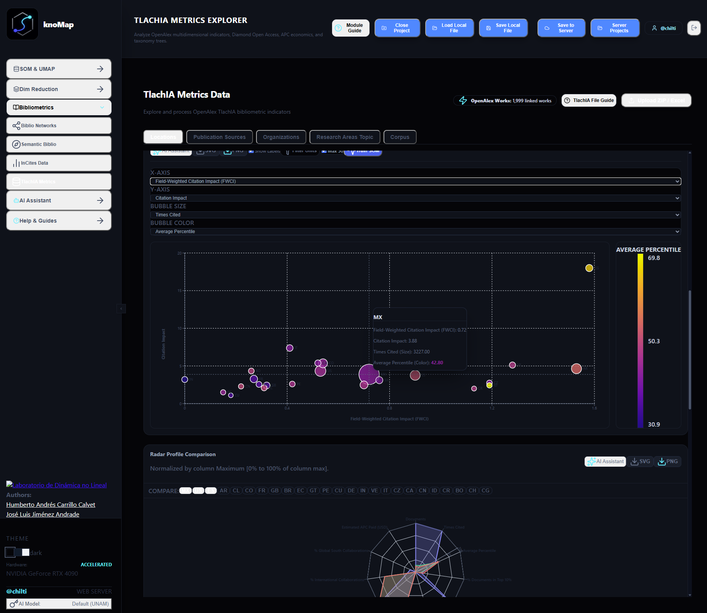
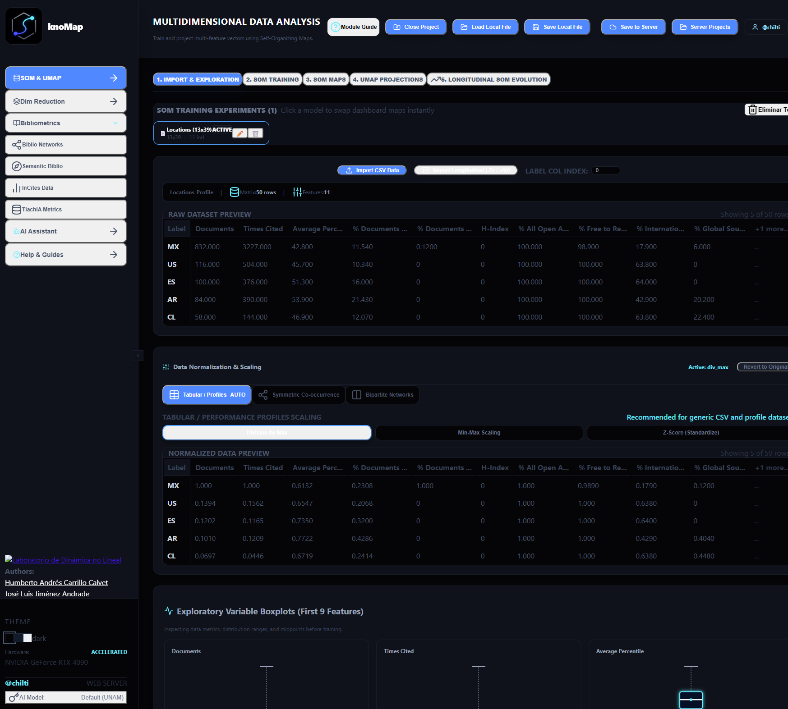
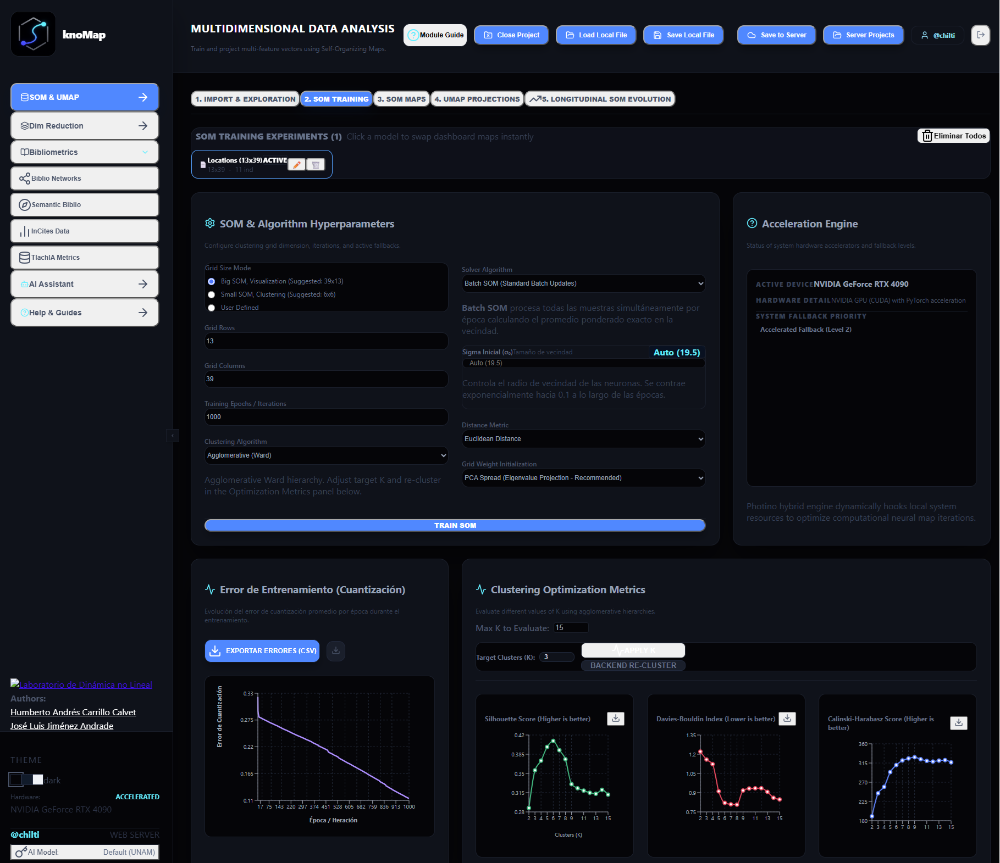
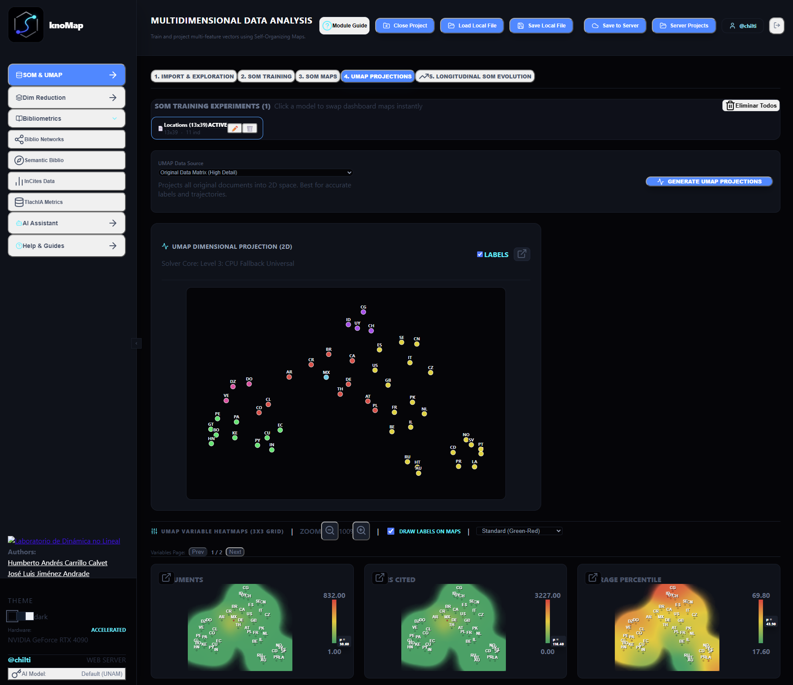

# knoMap

[](https://doi.org/10.5281/zenodo.22693920)
[](LICENSE)

**knoMap** is an advanced analytical desktop and web platform developed by the Non-Linear Dynamics Laboratory at UNAM (Mexico). It enables researchers to explore, process, and visualize multidimensional data, bibliometric networks, and institutional indicators through Self-Organizing Maps (SOM), semantic analysis, and dimensionality reduction.

<p align="center">
  
</p>

---

## 🚀 System Architecture

The platform uses a three-layer heterogeneous architecture optimized for local performance:

| Layer | Technology | Description |
|---|---|---|
| **Frontend** | React + TypeScript + Vite | Interactive UI with SVG, Recharts, and D3.js visualizations |
| **Backend API** | C# (.NET 8) + Photino.NET | Local REST server + native desktop window |
| **Analytical Engine** | Python 3 | Parsing, mathematical computation, and AI models (scikit-learn, UMAP, etc.) |

The backend acts as an orchestrator: it serves the React interface as static files and invokes the Python engine as a subprocess on demand. Heavy data payloads **never travel all at once to the frontend** — the engine writes results to disk and the interface fetches them per unit via REST API.

---

## 💻 Installation (Desktop Version)

The desktop version **does not require installing Python, Node.js, or .NET** separately. Everything is pre-packaged and bundled ready to run.

> 📥 **Official Release Assets & Downloads:**  
> All standalone desktop binaries and installers are available at:  
> **👉 [https://github.com/chilti/knomap/releases/tag/v1.0.0](https://github.com/chilti/knomap/releases/tag/v1.0.0)**

| Operating System | Package | Direct Download Link |
|---|---|---|
| 🪟 **Windows** (x64) | Standalone Installer | [Download `knoMap_Installer_Lite.exe`](https://github.com/chilti/knomap/releases/tag/v1.0.0) |
| 🍏 **macOS** (Apple Silicon M1/M2/M3) | Portable App Bundle (`.zip`) | [Download `knoMap_Mac_Silicon.zip`](https://github.com/chilti/knomap/releases/tag/v1.0.0) |
| 🍏 **macOS** (Intel x64) | Portable App Bundle (`.zip`) | [Download `knoMap_Mac_Intel.zip`](https://github.com/chilti/knomap/releases/tag/v1.0.0) |
| 🐧 **Linux** (x64) | Standalone Binary (`.zip`) | [Download `knoMap_Linux.zip`](https://github.com/chilti/knomap/releases/tag/v1.0.0) |

### Quick Start by OS

- **Windows:** Download and execute `knoMap_Installer_Lite.exe` and follow the guided setup wizard.
- **macOS:** Download the respective ZIP for your processor, unzip, and move `knoMap.app` to your `/Applications` folder. *(If macOS Gatekeeper prevents opening, check `INSTRUCCIONES_MAC.txt` included in the package).*
- **Linux:** Download `knoMap_Linux.zip`, extract the files, ensure execution permissions (`chmod +x knoMap`), and launch the binary.

---

## 📦 Server Deployment (Web Production)

To host the platform on a server and provide access to multiple users:

**Requirements:** Docker with the Compose V2 plugin. Nvidia Container Toolkit (optional, recommended).

```bash
git clone https://github.com/chilti/knomap.git
cd knomap
docker compose up -d --build
```

The platform will be available on port `5015`. Configure an Nginx reverse proxy to `http://localhost:5015`.

### 🔑 Server Authentication & Initial Administrator Account

When deployed to a server, **knoMap** enforces JWT user authentication, server-side project persistence, and project sharing:

- **Initial Admin Credentials:** Upon first startup, the system automatically initializes SQLite database migrations and creates a default administrator account:
  - **Username:** `admin`
  - **Default Password:** `admin123`
- **Custom Admin Password (Recommended):** You can define a custom administrator password and JWT secret using environment variables in `docker-compose.yml` or `docker run`:
  ```yaml
  environment:
    - ADMIN_PASSWORD=MySecretPassword2026!
    - JWT_SECRET=CustomSuperSecretJWTKey123!
  ```
- **User Management:** Log in as `admin` on the web interface and click **Users** in the header to register new user accounts for your team members.
- **Desktop Mode Note:** Standing desktop installations auto-authenticate as `@desktop_local` in background, requiring zero login prompts for local users.

---

## 🛠 Development Environment (Local)

### 1. Start the Backend (.NET + Python)

Requirements: .NET 8 SDK and Python 3 with the engine dependencies installed.

```powershell
cd backend/src/knoMap.Backend.Core
dotnet run
```

The backend initializes at `http://localhost:5123` and opens the desktop window.

### 2. Start the Frontend in Dev Mode

Requirements: Node.js.

```powershell
cd frontend
npm install
npm run dev
```

The React application will connect to the backend at `http://localhost:5123`.

### 3. Build the Frontend for Production

```powershell
cd frontend
npm run build
```

The compiled artifact is automatically copied to `backend/src/knoMap.Backend.Core/wwwroot/`, which is what the desktop application serves.

---

## ⚙️ Modules and Features

### 🔵 Bibliometrics & Science Mapping
Processing of files exported from **Web of Science** or **PubMed** to generate and explore complex co-occurrence networks.

<p align="center">
  
</p>

- **Supported network types:** Co-occurrence (keywords, MeSH terms, custom fields), Co-authorship, Co-citation, Citation, Bibliographic Coupling, Bipartite (two custom fields).
- **Temporal mode:** Generates a network series by year to analyze thematic evolution over time.
- **SOM Integration:** A button transfers the calculated network directly to the "Data & SOM" module for training.

### 🔵 InCites & Institutional Indicators (TlachIA Metrics)
Explorer for institutional indicators exported from **Clarivate InCites** or institutional metrics pipelines.

<p align="center">
  
</p>

- **Loading:** Accepts individual or multiple Excel (`.xlsx`) files, or a full **ZIP** archive containing all indicators for an institution.
- **Automatic unit detection:** Identifies the unit type (Researchers, Organizations, Locations, Publication Sources, Funding Agencies, WoS Categories, ESI, SDG, Macro/Meso/Micro Topics, Patentometrics) from the filename.
- **Lazy loading:** Python processes all files and writes results to disk. The interface downloads **only the active unit** at any time to avoid overloading browser memory.
- **Per-unit visualizations:**
  - **Multidimensional profile table** with up to 1,500 entities (Top by production).
  - **Time series chart** with ECMA-3 and ECMA-5 smoothing, showing the Top 20 entities.
  - **Quartile distribution chart** (Q1–Q4) per entity.
- **Export to SOM:** Select a subset of indicators and train a SOM neural network directly on the entities of the active unit.

### 🔵 Data & SOM (Self-Organizing Maps)
The core neural engine for data ingestion, variable selection, neural training, and exploring **Kohonen Self-Organizing Maps (SOM)**.

<p align="center">
  
</p>

<p align="center">
  
</p>

<p align="center">
  
</p>

- **Data import:** CSV/Excel files or direct transfer from the Bibliometrics and InCites modules.
- **Normalization:** Apply and revert transformations on the data matrix.
- **Batch SOM training:** PCA or random initialization, with real-time quantization error visualization.
- **Interactive hexagonal grid:** Map visualization with color-coding by indicator, cluster contours, and entity labels. Labels can be repositioned by dragging.
- **Re-clustering:** Dynamic adjustment of the number of groups without retraining.
- **UMAP projection:** Visualization of neuron similarity in a 2D space overlaid on the SOM.
- **Project export:** Save and load the complete analysis state (`.json`).

### 🔵 Dim Reduction & Manifold Learning (UMAP)
Independent **dimensionality reduction** and manifold geometry module.

<p align="center">
  
</p>

- Estimation of the intrinsic dimension of the dataset (skdim, MLE).
- Reduction to a target dimension using algorithms available in the Python engine (UMAP, PCA).
- Visualization and export of the reduced matrix for use in the SOM module.

### 🔵 Semantic Bibliometrics
**Deep semantic analysis** of scientific articles exported from Web of Science.

- **Preprocessing:** Extracts and combines titles, abstracts, keywords, and MeSH terms from each document.
- **Embedding generation:** Document vectorization using language models (Nomic Embed, SPECTER).
- **Intrinsic dimension estimation:** Analysis of the semantic space of documents.
- **Dimensionality reduction:** Compression of the semantic space for SOM training.
- **Semantic clustering:** Multi-level hierarchical grouping of documents by thematic content.

---

## 🖥 User Interface

- **Collapsible sidebar** for navigation between the 5 modules.
- **Custom title bar** (desktop mode) with native minimize, maximize, and close controls.
- **Window resizing** with the mouse and keyboard shortcuts (Win + ← / →, etc.).
- **Hardware indicator** in the sidebar: automatically detects if an NVIDIA GPU is available to accelerate computations.
- **Project persistence:** Export and import the complete analysis in `.json` format to resume sessions later.

---

## 👥 Developed by

- **Non-Linear Dynamics Laboratory** — Department of Mathematics, Faculty of Sciences, UNAM
- **Dr. José Luis Jiménez Andrade** (Facultad de Ciencias & C3, UNAM)
- **Dr. Humberto Andrés Carrillo Calvet** (Facultad de Ciencias & C3, UNAM)

🔗 [www.dynamics.unam.mx](https://www.dynamics.unam.mx/)

---

## 📖 How to Cite / Cómo Citar

If you use **knoMap** in your research, science mapping projects, or software workflows, please cite this platform using the following official reference:

### APA:
> Jiménez Andrade, J. L., & Carrillo Calvet, H. A. (2026). *knoMap: Advanced Analytical Platform for Multidimensional Data and Bibliometric Science Mapping* (Version v1.0.0) [Computer software]. Zenodo. [https://doi.org/10.5281/zenodo.22693920](https://doi.org/10.5281/zenodo.22693920)

### BibTeX:
```bibtex
@software{jimenez_andrade_2026_22693920,
  author       = {Jiménez Andrade, José Luis and
                  Carrillo Calvet, Humberto Andrés},
  title        = {knoMap: Advanced Analytical Platform for Multidimensional Data and Bibliometric Science Mapping},
  month        = sep,
  year         = 2026,
  publisher    = {Zenodo},
  version      = {v1.0.0},
  doi          = {10.5281/zenodo.22693920},
  url          = {https://doi.org/10.5281/zenodo.22693920}
}
```

---

## 🙏 Acknowledgments / Agradecimientos

We express our special recognition and gratitude to **Romel Calero Ramos** for the architecture, deployment, and maintenance of the high-performance **ClickHouse** analytical database and server infrastructure at the **Center for Complexity Sciences (C3, UNAM)**, which powers the large-scale data querying and processing of this platform.

*Nuestro especial reconocimiento y agradecimiento a **Romel Calero Ramos**, por el diseño, despliegue y administración de la infraestructura de servidores y base de datos analítica masiva en **ClickHouse** en el **Centro de Ciencias de la Complejidad (C3, UNAM)**, pilar fundamental para el procesamiento y consulta a gran escala de los datos de este proyecto.*
