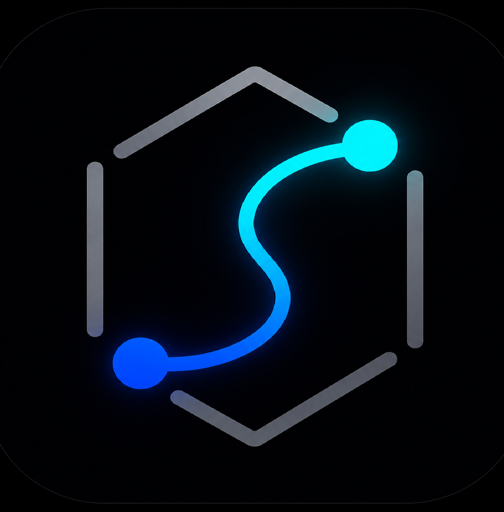

# LabSOM: Advanced Bibliometric & Multidimensional Data Explorer

**LabSOM** es una plataforma analítica avanzada diseñada para procesar, entrenar y visualizar datos multidimensionales y métricas bibliográficas a través de Mapas Auto-organizados (Self-Organizing Maps) y Redes de Co-ocurrencia.



## 🚀 Arquitectura del Sistema

LabSOM cuenta con una arquitectura de microservicios heterogénea optimizada para alto rendimiento:

1. **Frontend**: Aplicación Web React interactiva potenciada por **Vite**, **TypeScript** y **TailwindCSS**. Soporta renderizado de gráficos avanzados con D3.js.
2. **Backend API**: Servidor RESTful de alto desempeño escrito en **C# (.NET 8)**.
3. **Motor Analítico**: Subsistema en **Python 3** equipado con `scikit-learn`, `networkx`, `umap-learn` y `metaknowledge` para el procesamiento matemático pesado (Reducción de Dimensionalidad y Parseo Bibliométrico).

---

## 💻 Instalación (Versión de Escritorio)

La forma más sencilla de utilizar LabSOM es a través de su aplicación nativa de escritorio, disponible para Windows, macOS y Linux.

Para instalar la aplicación, dirígete a la sección de **Releases** del repositorio y descarga el paquete correspondiente a tu sistema operativo:

### Windows
Descarga y ejecuta el archivo `SinapsisMap_Installer_Lite.exe`. Sigue las instrucciones del asistente de instalación para completar el proceso.

### macOS (Intel y Apple Silicon)
1. Descarga el archivo `SinapsisMap_Mac_Intel.zip` o `SinapsisMap_Mac_Silicon.zip` según el procesador de tu Mac.
2. Descomprime el archivo y arrastra la aplicación `SinapsisMap.app` a tu carpeta de Aplicaciones.

*(Nota importante: Dado que la aplicación se distribuye en un ZIP externo, macOS podría revocar los permisos de ejecución por seguridad. Si la aplicación no abre, revisa el archivo `INSTRUCCIONES_MAC.txt` incluido en el ZIP para solucionarlo en un paso).*

### Linux
Descarga el archivo `SinapsisMap_Linux.zip`, extrae su contenido y ejecuta el binario principal.

---

## 📦 Despliegue en Servidor (Producción)

Si prefieres alojar la plataforma en la web para múltiples usuarios, la forma recomendada de desplegar LabSOM en producción (ej. Servidor Ubuntu) es mediante **Docker**. El ecosistema está preparado para aprovechar la GPU (Nvidia/CUDA) del servidor anfitrión para acelerar el entrenamiento.

### Requisitos Previos

- Docker y Docker Compose
- Nvidia Container Toolkit (opcional, recomendado para aceleración CUDA)

### Instalación Rápida

1. Clona el repositorio:

   ```bash
   git clone https://github.com/chilti/newLabSOM.git
   cd newLabSOM
   ```
2. Levanta los contenedores:

   ```bash
   docker-compose up -d --build
   ```
3. El sistema estará disponible internamente en el puerto `5015`. Si usas Nginx como proxy inverso en tu servidor, simplemente crea un `proxy_pass` hacia `http://localhost:5015`.

---

## 🛠 Entorno de Desarrollo (Local)

Si deseas modificar el código o desarrollar nuevas características, puedes levantar los servicios de manera local.

### 1. Iniciar el Backend (.NET)

Asegúrate de tener instalado el SDK de .NET 8 y Python 3 en tu sistema.

```powershell
cd backend/src/LabSOM.Backend.Core
dotnet run
```

El backend se inicializará y quedará escuchando en `http://localhost:5123`.

### 2. Iniciar el Frontend (React)

Asegúrate de tener Node.js instalado.

```powershell
cd frontend
npm install
npm run dev
```

La aplicación web se abrirá automáticamente en tu navegador local interactuando con el backend.

---

## ⚙️ Características Principales

- **Procesamiento Bibliométrico**: Extrae conocimiento de archivos exportados desde Web of Science o PubMed generando redes de co-autoría, co-citación o acoplamiento bibliográfico.
- **Entrenamiento SOM en Vivo**: Ajuste de matrices multidimensionales usando metodologías Batch.
- **Visualización UMAP**: Algoritmo `Scatter/Splat` superpuesto sobre mapas 2D del SOM.
- **Flujo de Trabajo Dinámico**: Análisis e importación de variables temporales mediante integración continua de matrices.

## 👥 Desarrollado por:

* **Laboratorio de Dinámica no Lineal**, Departamento de Matemáticas, Facultad de Ciencias, UNAM.
* **Dr. José Luis Jiménez Andrade**
* **Dr. Humberto Andrés Carrillo Calvet**

🔗 [https://www.dynamics.unam.mx/](https://www.dynamics.unam.mx/)
