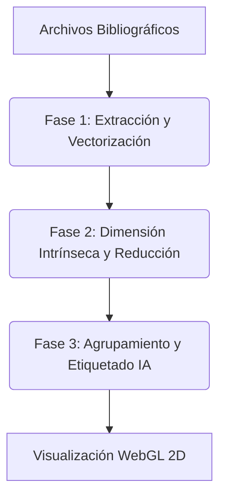

R

# LabSOM: Semantic Bibliometrics (White Paper)

## Resumen Ejecutivo

El módulo de **Bibliometría Semántica** (*Semantic Biblio*) de LabSOM representa una evolución en el análisis de literatura científica. A diferencia del enfoque tradicional basado puramente en co-ocurrencia léxica o de citas, este módulo emplea Inteligencia Artificial generativa y modelos de lenguaje (LLMs) para comprender el **contexto semántico profundo** de los artículos.

Mediante el uso de embeddings de alta dimensionalidad, algoritmos avanzados de reducción de dimensión topológica y clustering jerárquico asistido por IA, LabSOM logra mapear, agrupar y etiquetar automáticamente corpus bibliográficos enteros. Este documento detalla la fundamentación matemática y los algoritmos que componen cada fase del proceso.

---

## 1. Arquitectura del Proceso

El flujo de trabajo semántico se divide en tres etapas principales, diseñadas para transformar archivos bibliográficos crudos en un mapa de conocimiento interactivo e inteligible.



---

## 2. Fase 1: Carga, Extracción y Vectorización

### 2.1 Parseo de Datos

El sistema utiliza la librería `metaknowledge` para analizar de manera robusta formatos estándar de Web of Science (WoS), Scopus (.csv, .txt) y PubMed. Se extraen y limpian campos clave (Título, Abstract, Keywords). La información se concatena en una representación de texto textual unificada $T_i$ para cada documento $i$.

### 2.2 Vectorización (Embeddings)

El texto de cada documento se transforma en un **vector de alta dimensionalidad** $\mathbf{v}_i \in \mathbb{R}^d$ capaz de capturar matices semánticos y sinonimia. Este proceso se realiza mediante arquitecturas basadas en *Transformers* ([Ver Detalles del Algoritmo: Transformers y Embeddings](file:///c:/Users/jlja/Documents/newLabSOM/docs/algo_transformers_embeddings.md)) utilizando modelos densos pre-entrenados como SPECTER2 o Nomic-Embed.

Matemáticamente, la codificación de una secuencia de tokens de un documento $T_i$ a un vector continuo se define a través de mecanismos de auto-atención (*Self-Attention*):

```math
\text{Attention}(Q, K, V) = \text{softmax}\left(\frac{QK^T}{\sqrt{d_k}}\right)V
```

Donde $Q$ (queries), $K$ (keys) y $V$ (values) son proyecciones lineales de los tokens del texto. Al final del pipeline de la red neuronal, se obtiene una representación agrupada (normalmente mediante el token `[CLS]` o *mean-pooling*), resultando en el vector denso $\mathbf{v}_i$ normalizado por L2:

```math
\mathbf{v}_i = \frac{f_\theta(T_i)}{\|f_\theta(T_i)\|_2}
```

Esto permite que la similitud entre dos artículos pueda medirse directamente como el producto punto o similitud del coseno: $ \cos(\theta) = \mathbf{v}_i \cdot \mathbf{v}_j $.

---

## 3. Fase 2: Reducción Topológica (Dimensión Intrínseca y UMAP)

Los embeddings originales suelen poseer $d \ge 768$ dimensiones. Para mitigar la "maldición de la dimensionalidad" y permitir un clustering geométricamente válido, LabSOM reduce la dimensión en dos pasos matemáticos.

### 3.1 Estimación de la Dimensión Intrínseca (MLE)

Los documentos suelen residir en una variedad (*manifold*) de menor dimensión incrustada en $\mathbb{R}^d$. Para encontrar el "Target $K$" ideal, LabSOM emplea el estimador de Máxima Verosimilitud (MLE) ([Ver Detalles del Algoritmo: Estimación MLE](file:///c:/Users/jlja/Documents/newLabSOM/docs/algo_mle_intrinsic_dimension.md)).

Dado un punto $x$ y sus $k$ vecinos más cercanos con distancias $T_1(x) \le T_2(x) \le \dots \le T_k(x)$, la dimensión intrínseca local $\hat{m}_k(x)$ se estima asumiendo que los puntos se distribuyen uniformemente en una hiperesfera local:

```math
\hat{m}_k(x) = \left[ \frac{1}{k-1} \sum_{j=1}^{k-1} \log \frac{T_k(x)}{T_j(x)} \right]^{-1}
```

LabSOM calcula este valor para cada artículo y utiliza el **percentil 95 (P95)** de todas las dimensiones locales como el Target $K$ final para no perder información crítica estructural.

### 3.2 Uniform Manifold Approximation and Projection (UMAP)

Se emplea UMAP ([Ver Detalles del Algoritmo: UMAP](file:///c:/Users/jlja/Documents/newLabSOM/docs/algo_umap.md)) para reducir los vectores desde el espacio original a $K$ dimensiones (para clustering) y a 2 dimensiones (para visualización).
UMAP construye una representación topológica local basada en conjuntos simpliciales difusos. La probabilidad de que exista una arista (conectividad local) entre $x_i$ y $x_j$ se define con decaimiento exponencial:

```math
p_{i|j} = \exp\left(-\frac{d(x_i, x_j) - \rho_i}{\sigma_i}\right)
```

Donde $\rho_i$ es la distancia al vecino más cercano (asegurando conectividad local pura) y $\sigma_i$ es un factor de suavizado. La estructura difusa conjunta es $p_{ij} = p_{i|j} + p_{j|i} - p_{i|j}p_{j|i}$.

Finalmente, UMAP optimiza las coordenadas en baja dimensión $\mathbf{y}_i, \mathbf{y}_j$ minimizando la Entropía Cruzada (*Cross-Entropy*) entre la representación topológica de alta y baja dimensión:

```math
C = \sum_{i \ne j} \left( p_{ij} \log \left(\frac{p_{ij}}{q_{ij}}\right) + (1 - p_{ij}) \log \left(\frac{1 - p_{ij}}{1 - q_{ij}}\right) \right)
```

Donde $q_{ij}$ es la similitud modelada en la baja dimensión (usando una distribución tipo Student-t aproximada).

---

## 4. Fase 3: Agrupamiento Jerárquico y Etiquetado Semántico

Con el espacio optimizado en la dimensión intrínseca $K$, el sistema agrupa y extrae la narrativa de las comunidades.

### 4.1 Clustering por Densidad (HDBSCAN)

Se emplea HDBSCAN ([Ver Detalles del Algoritmo: HDBSCAN](file:///c:/Users/jlja/Documents/newLabSOM/docs/algo_hdbscan.md)) para agrupar los artículos en el espacio reducido. A diferencia de K-Means, HDBSCAN no asume clusters esféricos ni requiere predefinir el número de grupos. Transforma el espacio basándose en la distancia de "alcance mutuo" (*Mutual Reachability Distance*):

```math
d_{\text{mreach}-k}(a, b) = \max\{\text{core}_k(a), \text{core}_k(b), d(a,b)\}
```

Donde $\text{core}_k(x)$ es la distancia de $x$ a su $k$-ésimo vecino más cercano. HDBSCAN construye un Árbol de Recubrimiento Mínimo (MST) con estas distancias y condensa el árbol jerárquico para extraer clústeres planos altamente estables que descartan el ruido (outliers).

### 4.2 Sub-Clustering y Extracción de Términos Clave (TF-IDF)

Para extraer el significado semántico inicial o como técnica de *fallback*, LabSOM calcula el TF-IDF ([Ver Detalles del Algoritmo: TF-IDF](file:///c:/Users/jlja/Documents/newLabSOM/docs/algo_tfidf.md)) de los términos en los resúmenes/títulos de cada clúster:

```math
\text{tf-idf}(t, d, D) = \text{tf}(t, d) \cdot \log\left(\frac{N}{|\{d \in D : t \in d\}|}\right)
```

Identificando así las palabras que son altamente representativas de un clúster pero raras en el corpus global.

### 4.3 Etiquetado Semántico Automático Asistido por LLM

LabSOM implementa un etiquetado heurístico generativo impulsado por Large Language Models.
Se calcula el centroide semántico de cada clúster $C$ en el espacio intrínseco:

```math
\mathbf{\mu}_C = \frac{1}{|C|} \sum_{i \in C} \mathbf{v}_i
```

Se calculan las similitudes de coseno de los artículos con $\mathbf{\mu}_C$ y se extraen los 10 títulos más representativos junto con sus descriptores TF-IDF. Esta información condiciona un *prompt* en un LLM local, el cual infiere y comprime cognitivamente la semántica de la frontera disciplinar, retornando una etiqueta taxonómica humana de corta longitud.

---

## 5. Referencias Bibliográficas

- Campello, R. J., Moulavi, D., & Sander, J. (2013). **Density-based clustering based on hierarchical density estimates.** In *Advances in Knowledge Discovery and Data Mining* (pp. 160-172). Springer Berlin Heidelberg.
- Cohan, A., Feldman, S., Beltagy, I., Downey, D., & Weld, D. S. (2020). **SPECTER: Document-level Representation Learning using Citation-informed Transformers.** *In Proceedings of the 58th Annual Meeting of the Association for Computational Linguistics* (pp. 2270–2282).
- Levina, E., & Bickel, P. J. (2004). **Maximum likelihood estimation of intrinsic dimension.** *Advances in neural information processing systems*, 17.
- McInnes, L., Healy, J., & Melville, J. (2018). **UMAP: Uniform Manifold Approximation and Projection for Dimension Reduction.** *arXiv preprint arXiv:1802.03426*.
- Vaswani, A., Shazeer, N., Parmar, N., Uszkoreit, J., Jones, L., Gomez, A. N., ... & Polosukhin, I. (2017). **Attention is all you need.** *Advances in neural information processing systems*, 30.
