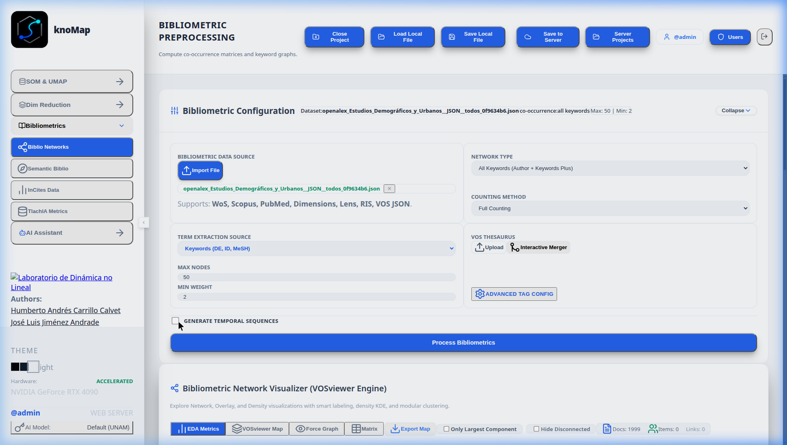
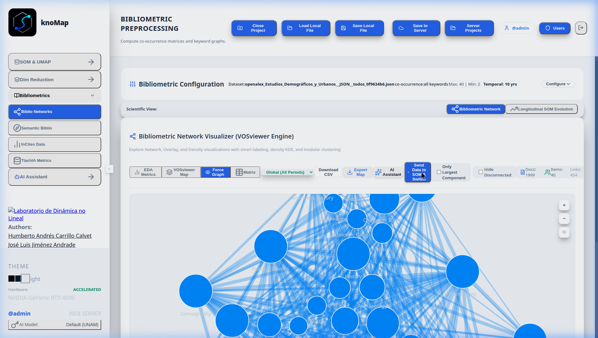
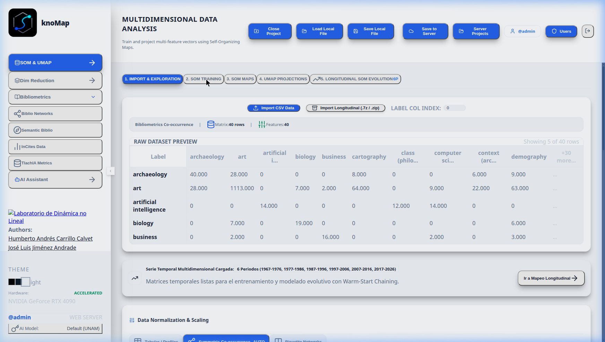
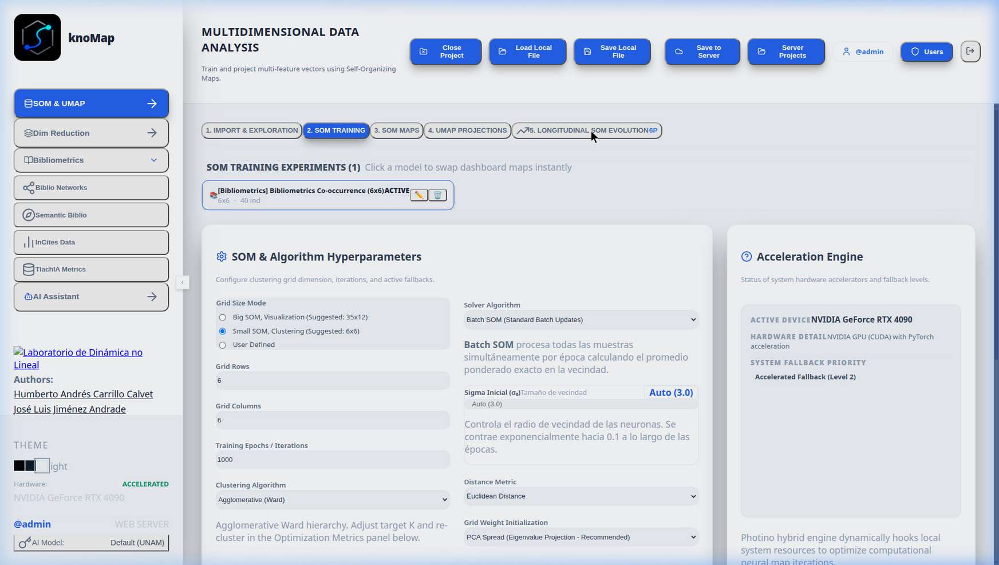
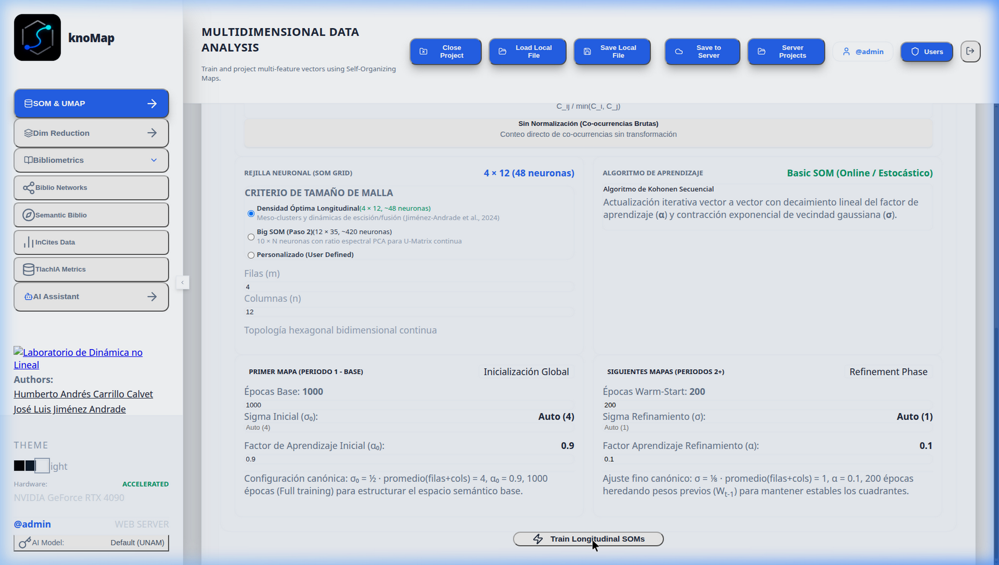
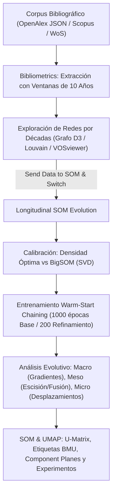

# Tutorial: Análisis Longitudinal de Coocurrencia de Palabras en Ventanas Decenales (10 Años) con KnoMap

Este tutorial ofrece una guía integral, metodológica y práctica para realizar un **análisis cienciométrico longitudinal de coocurrencia de palabras clave en ventanas temporales de 10 años**. A lo largo de este documento se detalla cómo cargar un corpus científico, extraer y explorar secuencias de redes de coocurrencia, entrenar redes neuronales de Kohonen con **encadenamiento intertemporal Warm-Start** y transferir los resultados al módulo **SOM & UMAP** para inspeccionar experimentos, etiquetas (BMUs) y mapas de componentes.

---

## Fundamento Científico y Metodológico

El análisis de coocurrencia de palabras clave (*Author Keywords* y *Keywords Plus*) permite mapear la estructura cognitiva y los frentes de investigación de un campo científico. Sin embargo, al segmentar un corpus en múltiples épocas históricas, los mapas autoorganizados (SOM) tradicionales presentan un problema crítico: **la invarianza rotacional y la estocasticidad de inicialización**, lo que causa que los mapas de diferentes periodos giren o se reflejen aleatoriamente, impidiendo una comparación espacial directa.

Para resolver esto, KnoMap implementa la metodología de:

> **Jiménez-Andrade, J. L., Martí-Lahera, Y., & Carrillo-Calvet, H. (2024).** *Neural longitudinal mapping of multidimensional performance profiles of Latin American universities.* **Iberoamerican Journal of Science Measurement and Communication**, 4(1), 1–16. https://doi.org/10.47909/ijsmc.92

### ¿Por qué ventanas de 10 años?
En la literatura bibliométrica y de historia de la ciencia, las **ventanas decenales (10 años)** permiten:
1. Suavizar las variaciones aleatorias anuales en el uso de terminología.
2. Garantizar una densidad mínima de enlaces de coocurrencia en épocas tempranas.
3. Rastrear la evolución de paradigmas temáticos a escala generacional o de consolidación disciplinar.

---

## Dataset de Referencia

Para este tutorial utilizaremos el corpus bibliográfico oficial:
* **Archivo:** `openalex_Estudios_Demográficos_y_Urbanos__JSON__todos_0f9634b6.json` (disponible en la carpeta de descargas).
* **Volumen:** 1,999 artículos científicos de la revista *Estudios Demográficos y Urbanos* de El Colegio de México.
* **Cobertura temporal:** 1967 a 2026 (~60 años de investigación, equivalentes a **6 períodos decenales consecutivos**).

---

## 1. Configuración del Corpus y Extracción de Redes Decenales

1. Inicie sesión en la plataforma KnoMap (por defecto en `http://localhost:5015` o `http://localhost:5173`) con sus credenciales de administrador (`admin`).
2. En la barra de navegación lateral izquierda, seleccione la pestaña **Bibliometrics** (icono de red/grafo) y elija la vista **Biblio Networks**.
3. En el panel izquierdo de **Bibliometric Preprocessing**, configure los siguientes parámetros:
   * **Network Type:** `Co-occurrence (Keywords, etc.)`.
   * **Tag / Extraction Source:** `DE` (Palabras clave del autor / Keywords OpenAlex).
   * **Max Nodes / Terms:** `40` (selecciona los 40 conceptos más prominentes para garantizar una interpretabilidad nítida).
   * **Min Co-occurrence:** `2`.
   * **Generate Temporal Sequences:** Marque la casilla para activar la descomposición longitudinal.
   * **Custom Temporal Window:** Establezca el valor en `10` (años).
4. Presione el botón **Process Bibliometrics**.

El motor de extracción procesará los 1,999 documentos y generará automáticamente **6 subperíodos consecutivos**:
- `1967-1976` (Periodo pionero)
- `1977-1986` (Consolidación)
- `1987-1996` (Crecimiento temático)
- `1997-2006` (Diversificación urbana y ambiental)
- `2007-2016` (Institucionalización demográfica)
- `2017-2026` (Frentes contemporáneos: migración, gobernanza, resiliencia)

---

## 2. Exploración Interactiva de las Redes Bibliométricas

Al completarse el cálculo, la interfaz renderizará el grafo interactivo de coocurrencia:

1. **Selector de Períodos Temporales:** En la barra superior, use el desplegable de periodos para alternar entre la red `Global` y cualquiera de los 6 cortes decenales (`1967-1976`, `1977-1986`, ..., `2017-2026`).
2. **Grafo de Fuerzas D3 (Force-Directed Graph):**
   * Los **nodos** representan términos/palabras clave, dimensionados por su frecuencia acumulada en esa década.
   * Las **aristas** indican la intensidad del enlace de coocurrencia (peso normalizado por Salton / Asociación).
   * Los **colores** reflejan comunidades semánticas detectadas mediante el algoritmo de **partición de Louvain**.
3. **Filtros de Componente:**
   * Active `Only Largest Component` para focalizar el análisis en el núcleo conceptual conectado y filtrar términos aislados o periféricos.
4. **Vistas Alternativas:**
   * **Matrix:** Muestra la matriz de adyacencia de coocurrencia $40 \times 40$ lista para descargar en formato CSV.
   * **VOSviewer Web:** Visualización nativa de densidad temática idéntica a VOSviewer Desktop.

Una vez exploradas las redes por década, haga clic en el botón **Send Data to SOM & Switch** en la barra superior. Esto cargará la serie temporal multidimensional completa en el módulo de entrenamiento neuronal.

---

## 3. Configuración del SOM Encadenado Longitudinalmente (*Warm-Start Chaining*)

Al hacer clic en la pestaña **2. SOM Training**, KnoMap ofrece la calibración espectral y dimensional de la malla neuronal:

1. **Selección del Criterio de Tamaño de Malla:**
   * **Densidad Óptima ($\sqrt{5\sqrt{N}}$):** Recomendada para redes bibliométricas densas, evitando celdas vacías y maximizando la interpretabilidad de clusters consolidados.
   * **BigSOM ($5\sqrt{N}$):** Recomendada cuando se busca una granularidad fina para aislar frentes de investigación emergentes o perfiles singulares.
   * La relación de aspecto $C / R$ se calibra automáticamente mediante descomposición en valores singulares (**SVD espectral**) a partir de los dos componentes principales dominantes:
     $$\frac{C}{R} \approx \sqrt{\frac{\lambda_1}{\lambda_2}}$$

2. **Acceso al Módulo 5. Longitudinal SOM Evolution:**
   * Haga clic en la subpestaña **5. Longitudinal SOM Evolution**.
   * Verifique que aparezcan listados los **6 subperíodos consecutivos** detectados.
   * En la cabecera verá la confirmación del conjunto de matrices preparadas:
     `6 Periodos (1967-1976, 1977-1986, 1987-1996, 1997-2006, 2007-2016, 2017-2026)`.

3. **Protocolo Canónico de Hiperparámetros (Jiménez-Andrade et al., 2024):**
   * **Período Base ($T_1 = 1967\text{--}1976$):**
     * **Épocas:** `1000`.
     * **Tasa de Aprendizaje Inicial:** $\alpha_0 = 0.90$.
     * **Radio de Vecindad Inicial:** $\sigma_0 = \frac{1}{2}\bar{D}$ (orientación topológica global).
     * **Inicialización:** PCA.
   * **Períodos Posteriores ($T_2 \dots T_6$):**
     * **Épocas de Refinamiento:** `200`.
     * **Tasa de Aprendizaje Reducida:** $\alpha = 0.10$.
     * **Radio de Vecindad Acotado:** $\sigma = \frac{1}{8}\bar{D}$ (ajuste fino de fronteras sin giros globales).
     * **Inicialización Sináptica:** **Warm-Start** ($W_0^{(t)} = W_*^{(t-1)}$). Los pesos finales de la década previa son el punto de partida de la siguiente.
   * **Normalización Intertemporal:** Seleccione `Cosine` (óptima para matrices de coocurrencia término $\times$ término).

4. Presione el botón **Train Longitudinal SOMs**.

---

## 4. Análisis Evolutivo en Tres Niveles (Macro, Meso, Micro)

Una vez completado el entrenamiento en PyTorch, el visor interactivo de KnoMap permite evaluar la dinámica de las palabras clave en tres escalas científicas:

### A. Nivel Macro: Trayectorias y Deriva de Gradientes
* **Timeline Player:** Use la barra deslizante temporal para reproducir la transición entre décadas. Observe cómo el núcleo conceptual migra suavemente en la malla hexagonal.
* **Side-by-Side View:** Compare simultáneamente los 6 mapas decenales colocados en paralelo. Identifique si las zonas de alta concentración temática se mantienen estables o sufren desplazamientos de fase.

### B. Nivel Meso: Dinámica de Clusters (Escisión y Fusión)
* **Cluster Splitting (Escisión):** Detecta términos que compartían un mismo cluster en décadas anteriores (e.g. `1977-1986`) y que se dividen en clusters separados en décadas recientes (e.g. `2007-2016`), indicando **especialización y madurez disciplinar**.
* **Cluster Merging (Fusión):** Términos de clusters independientes que convergen en una misma agrupación neuronal, indicando **hibridación temática o interdisciplinariedad**.
* **Diagrama Aluvial (Thematic Migration):** El gráfico de flujo aluvial muestra visualmente el caudal de palabras que transitan entre comunidades a través de los 60 años.

### C. Nivel Micro: Deriva Sináptica y Perfiles Singulares
* **Deriva Sináptica ($\Delta W$):** El mapa de calor de tensión neuronal resalta las celdas del mapa que experimentaron mayor presión de cambio entre décadas contiguas:
  $$\Delta W_j = \| W_j^{(t)} - W_j^{(t-1)} \|_2$$
* **Perfiles Singulares:** Palabras clave aisladas en neuronas individuales ($|C_k| = 1$). El visor longitudinal permite verificar si estos términos eran emergencias efímeras de una década particular o precursores de frentes consolidados.

---

## 5. Transferencia a SOM & UMAP: Experimentos, Etiquetas y Mapas de Componentes

Para profundizar en el análisis de variables individuales y comparar múltiples corridas de entrenamiento:

1. Haga clic en la subpestaña **3. SOM Maps** en el módulo **SOM & UMAP**.
2. **Visualización de Etiquetas (Labels / BMUs):**
   * Active la casilla **Show Entity Labels**.
   * Cada neurona mostrará las palabras clave proyectadas sobre su coordenada hexagonal (Best Matching Units).
   * La **U-Matrix** en escala de grises o viridis muestra la distancia inter-neuronal: las cuencas claras corresponden a núcleos temáticos compactos, mientras que las líneas oscuras representan fronteras conceptuales.

3. **Mapas de Componentes (Component Planes):**
   * En el selector de componentes, elija cualquier palabra clave del corpus (por ejemplo: *Fecundidad*, *Migración*, *Urbanización*, *Mortalidad*, *Mercado de Trabajo*).
   * El mapa mostrará la distribución de pesos sinápticos de esa palabra específica en toda la malla neuronal.
   * **Lectura de Correlaciones:** Si dos mapas de componentes presentan patrones cromáticos idénticos (zonas cálidas y frías coincidentes), indica que dichos términos coocurren sistemáticamente y forman un frente conceptual común.
4. **Proyección Dimensional UMAP (2D / 3D):**
   * Pase a la subpestaña **4. UMAP Projections**.
   * Compare la disposición topológica del SOM con la variedad no lineal UMAP calculada a partir de los vectores de coocurrencia.

5. **Gestor de Experimentos Multi-Training Runs:**
   * En el panel lateral derecho, el historial almacena cada ejecución (ej. corrida con *Densidad Óptima* vs. corrida con *BigSOM*).
   * Puede alternar con un solo clic entre cualquier experimento almacenado sin recalcular.
   * Si desea reiniciar el entorno, utilice el botón **Eliminar Todos los Experimentos**.

---

## Resumen del Flujo de Trabajo

---

## Recomendaciones para Publicación de Resultados

1. **Exportación de Figuras en Alta Resolución:**
   * En la cabecera de la red y de los mapas SOM, utilice los botones **SVG** y **PNG** para exportar gráficos listos para manuscritos científicos.
2. **Cita Metodológica:**
   * Al reportar los resultados en artículos o tesis, cite el protocolo canónico de encadenamiento intertemporal:
     * *Jiménez-Andrade, J. L., Martí-Lahera, Y., & Carrillo-Calvet, H. (2024). Neural longitudinal mapping of multidimensional performance profiles of Latin American universities. IJSMC, 4(1), 1–16.*
3. **Persistencia del Proyecto:**
   * Utilice la opción **Save Project to Server** para almacenar el estado completo en la base de datos `knomap_hub.db`, asegurando la reproducibilidad total del estudio cienciométrico.
